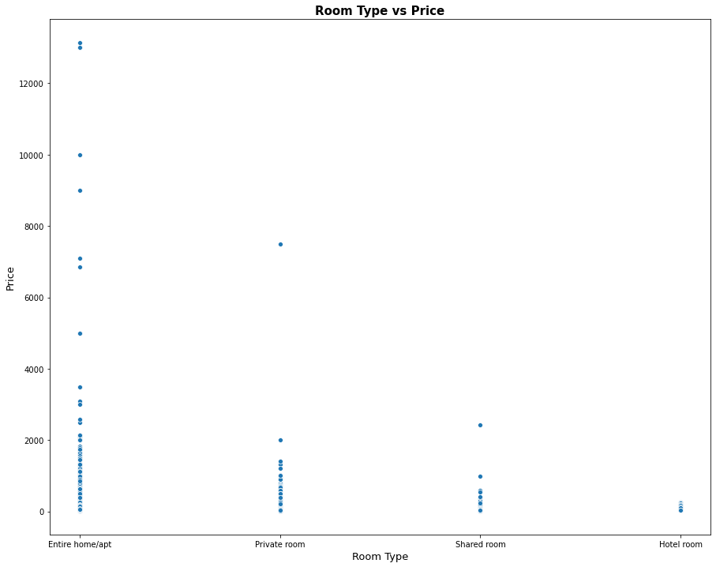
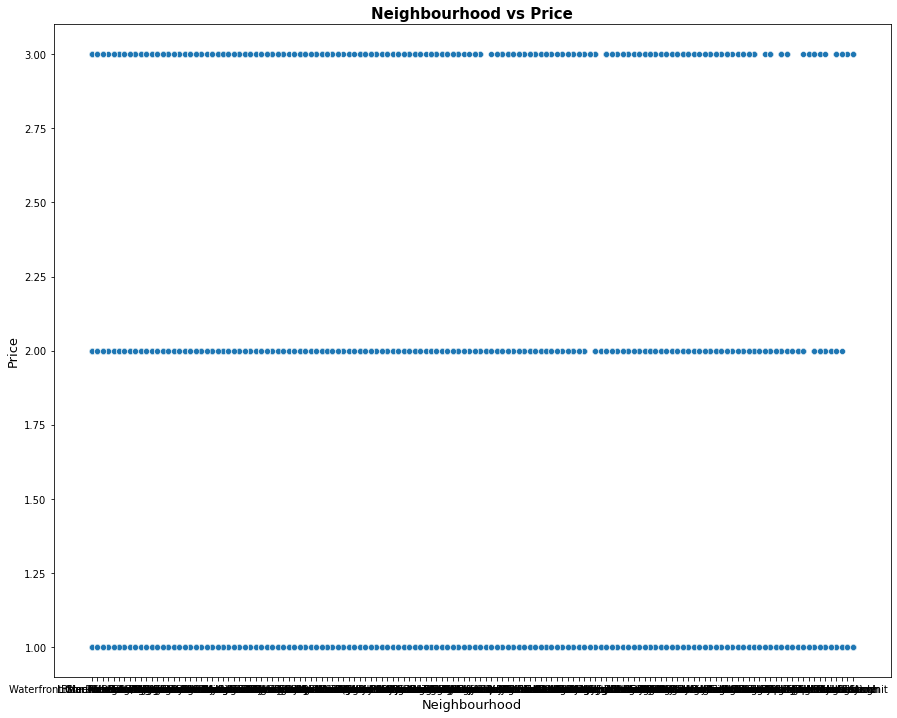
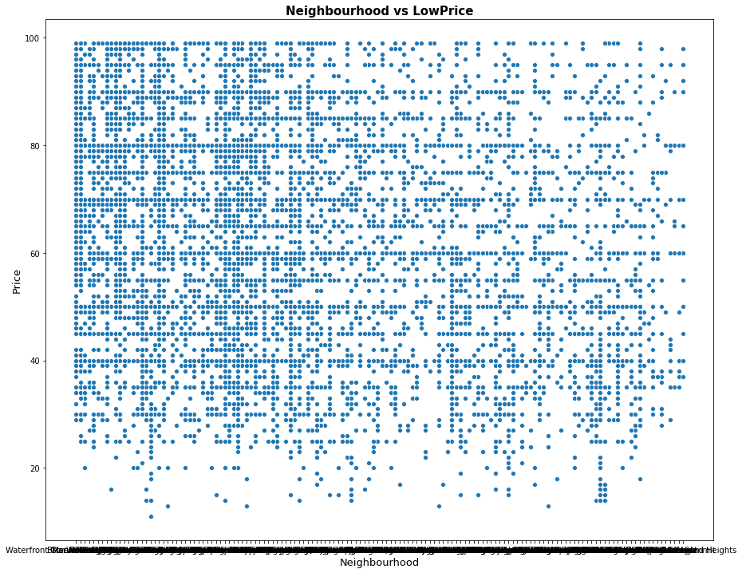
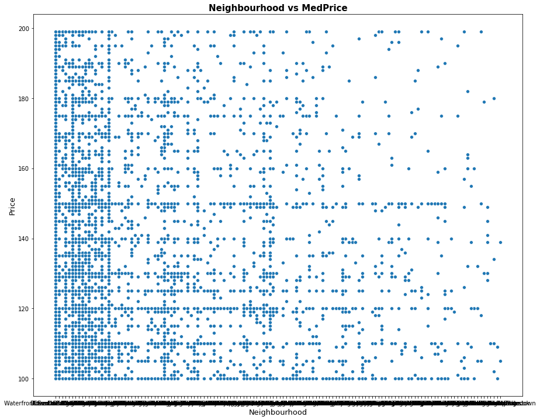
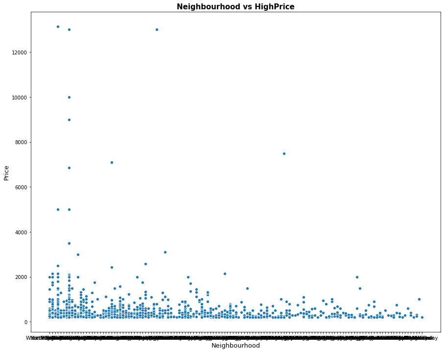
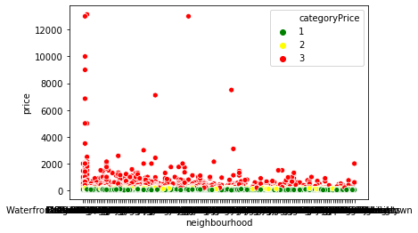
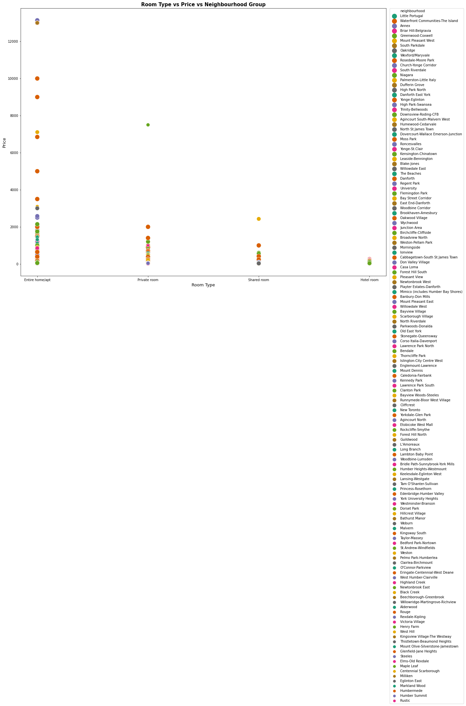

# Airbnb Toronto Price Prediction

##Introduction

Airbnb is an online marketplace that offers lodging services, homesyaing services and tourisim activities to travelors since 2008. In this project, I have performed EDA on Toronto airbnb data from june 3rd 2017. Toronto is the most populous city in Canada and is a destination to so many travallors. Hence, the Airbnb is plying a significant role
in the rental markettplace of Toronto. In this kernel, I built three classification models to choose the one with the highest prediction accuracy score. Meanwhile, I will discuss feature importance and the expolaratory analysis that I have done.
```import requests
import pandas as pd
import matplotlib.pyplot as plt
import seaborn as sns
import numpy as np
from numpy import nan

from sklearn.compose import ColumnTransformer
from sklearn.preprocessing import OneHotEncoder

from sklearn.model_selection import train_test_split
from imblearn.over_sampling import SMOTE
from sklearn.tree import DecisionTreeClassifier
from sklearn.ensemble import RandomForestClassifier
from sklearn.neighbors import KNeighborsClassifier
from sklearn.datasets import make_classification
from sklearn.metrics import accuracy_score
from sklearn.metrics import confusion_matrix```


First, let's explore the data content.

```
df.dtypes

            "text/plain": [
              "id                                  int64\n",
              "name                               object\n",
              "host_id                             int64\n",
              "host_name                          object\n",
              "neighbourhood_group               float64\n",
              "neighbourhood                      object\n",
              "latitude                          float64\n",
              "longitude                         float64\n",
              "room_type                          object\n",
              "price                               int64\n",
              "minimum_nights                      int64\n",
              "number_of_reviews                   int64\n",
              "last_review                        object\n",
              "reviews_per_month                 float64\n",
              "calculated_host_listings_count      int64\n",
              "availability_365                    int64\n",
              "dtype: object"
            ]
         
```

  id	host_id	neighbourhood	latitude	longitude	room_type	price	minimum_nights	number_of_reviews	last_review	reviews_per_month	calculated_host_listings_count	availability_365
1419	1565	Little Portugal	43.64617	-79.42451	Entire home 	469	4	7	2017-12-04	0.11	1	0
8077	22795	Waterfront Comm	43.64105	-79.37628	Private room	98	180	169	2013-08-27	1.24	2	365
12604	48239	Annex	          43.66724	-79.41598   Private room	66	1	0	NaN	NaN	1	0
23691	93825	Briar Hill-Belg	43.69602	-79.45468	Private room	70	1	217	2019-12-22	1.72	2	240
26654	113345	Waterfront Co	43.64530	-79.38940	Entire home 	125	21	40	2020-03-20	0.34	2	295


```


```

As expected, the price per night for entire property costs more and in the opposite, the shared rooms cost cheaper. Surprisingly, the hotels have the cheapest price among the other listing types. This can come form the fact that, Airbnb goal is accomadating travelors with any price point so the unheard and less famous hotels which have a cheaper pricing would more likely to post on Airbnb for attracting more customers by increasing the chance of being seen on Airbnb.
 

```


```
 The listings classified in three ctegories: high, medium and low pricing. The above plot is showing the three categories for pricing versus the locations. Also, the neighbourhood vs price is plotted for each category separatelt that can be found below. 
 
 ```


```
```


```
```


``` 
```


``` 

```


```
Comparing the plots, it can be understood that the data points density is less in medium price category and there existed outliers for the high price category. From the data points distribution over the neighbourhoods, It can also true to say that you can find a place matching your budget in any part of the city you wish depending on the room type.
