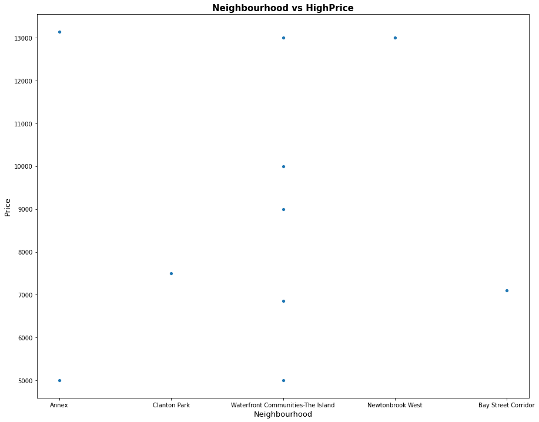
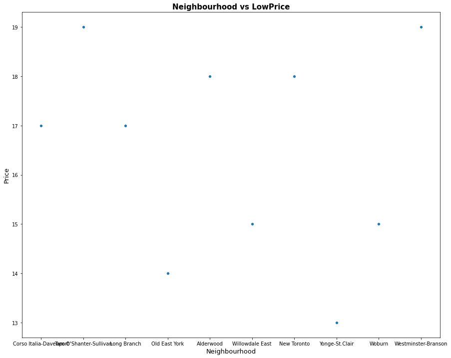
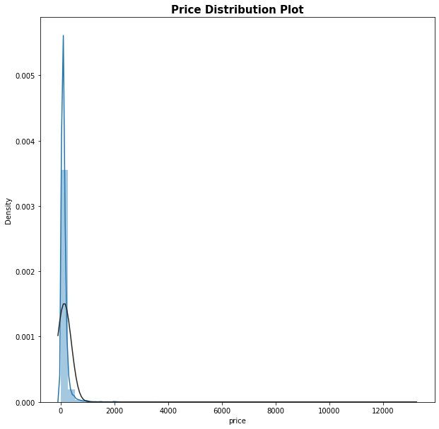

# Airbnb Toronto Price Prediction

##Introduction

Airbnb is an online marketplace that offers lodging services, homesyaing services and tourisim activities to travelors since 2008. In this project, I have performed EDA on Toronto airbnb data from june 3rd 2017. Toronto is the most populous city in Canada and is a destination to so many travallors. Hence, the Airbnb is plying a significant role
in the rental markettplace of Toronto. In this kernel, I built three classification models to choose the one with the highest prediction accuracy score. Meanwhile, I will discuss feature importance and the expolaratory analysis that I have done.
```import requests
import pandas as pd
import matplotlib.pyplot as plt
import seaborn as sns
import numpy as np
from numpy import nan
from scipy.stats import norm

from sklearn.compose import ColumnTransformer
from sklearn.preprocessing import OneHotEncoder

from sklearn.model_selection import train_test_split
from imblearn.over_sampling import SMOTE
from sklearn.tree import DecisionTreeClassifier
from sklearn.ensemble import RandomForestClassifier
from sklearn.neighbors import KNeighborsClassifier
from sklearn.datasets import make_classification
from sklearn.metrics import accuracy_score
from sklearn.metrics import confusion_matrix```


##Data Exploratory Analysis
First, let's explore the data content.

```
df.dtypes

            "text/plain": [
              "id                                  int64\n",
              "name                               object\n",
              "host_id                             int64\n",
              "host_name                          object\n",
              "neighbourhood_group               float64\n",
              "neighbourhood                      object\n",
              "latitude                          float64\n",
              "longitude                         float64\n",
              "room_type                          object\n",
              "price                               int64\n",
              "minimum_nights                      int64\n",
              "number_of_reviews                   int64\n",
              "last_review                        object\n",
              "reviews_per_month                 float64\n",
              "calculated_host_listings_count      int64\n",
              "availability_365                    int64\n",
              "dtype: object"
            ]
         
```

  id	host_id	neighbourhood	latitude	longitude	room_type	price	minimum_nights	number_of_reviews	last_review	reviews_per_month	calculated_host_listings_count	availability_365
1419	1565	Little Portugal	43.64617	-79.42451	Entire home 	469	4	7	2017-12-04	0.11	1	0
8077	22795	Waterfront Comm	43.64105	-79.37628	Private room	98	180	169	2013-08-27	1.24	2	365
12604	48239	Annex	          43.66724	-79.41598   Private room	66	1	0	NaN	NaN	1	0
23691	93825	Briar Hill-Belg	43.69602	-79.45468	Private room	70	1	217	2019-12-22	1.72	2	240
26654	113345	Waterfront Co	43.64530	-79.38940	Entire home 	125	21	40	2020-03-20	0.34	2	295


```


```

As expected, the price per night for entire property costs more and in the opposite, the shared rooms cost cheaper. Surprisingly, the hotels have the cheapest price among the other listing types. This can come form the fact that, Airbnb goal is accomadating travelors with any price point so the unheard and less famous hotels which have a cheaper pricing would more likely to post on Airbnb for attracting more customers by increasing the chance of being seen on Airbnb.
 

```


```
 The listings classified in three ctegories: high, medium and low pricing. The above plot is showing the three categories for pricing versus the locations. Also, the neighbourhood vs price is plotted for each category separatelt that can be found below. 
 
 ```


```
```


```
```


``` 
```


``` 

```


```
Comparing the plots, it can be understood that the data points density is less in medium price category and there existed outliers for the high price category. From the data points distribution over the neighbourhoods, It can also true to say that you can find a place matching your budget in any part of the city you wish depending on the room type.


```


```

```




```

The lowest and highest pricing in Airbnb Toronto listing can be found from the plots on the top. They show that the price per night can be as low as 11 CAD in Yonge-St. clair, while it goes up to 13000 CAD for the locations in Annex, Waterfron and Newtonbrook west.
```




```
The above distribution graph shows that there is a right_skew on the price, which means a positive skewness. It arises from the lack of symmetry in data distribution. As it was mentioned eralier that our data set is lacking data point in medium price, I am going to discuss the SMOTE method for imballanced data frame later on in a seperate section.

##Decision Tree Regression
At the beginig with this project, I decided to approach the model as a regression model. I applied the decision tree regressor on the data frame and create a list of feature importances.

```
#define dataset
X_reg=filtered_df.iloc[: , 7:-1].values
y_reg=filtered_df.iloc[:, -1].values
#Splitting the dataset into the Training set and Test set
from sklearn.model_selection import train_test_split
X_train, X_test, y_train, y_test = train_test_split(X_reg, y_reg, test_size = 0.4, random_state = 0)
#define the model
Regressor = DecisionTreeRegressor()


Regressor.fit(X_train, y_train)

from sklearn.model_selection import cross_val_score
cross_val_score(Regressor, X_reg, y_reg, cv=10)

array([ -2.23396125,  -1.34820058,  -0.04646368,  -1.23735069,
        -0.25799366,  -1.93097007,  -0.0681571 ,  -1.68680136,
        -2.11801324, -13.62971362])
```

The result of the decision tree regression model did not come out very accurate. I also tried different reggression models including random forest and SVM, but the results were not satisfying. However, I'd like to add a list below that shows the feature importance for each feature in order of the highest value to the lowest.

```
"text/plain": [
              "                            Feature_Name  Feature_Importance\n",
              "7                        Agincourt North        1.736697e-05\n",
              "8           Agincourt South-Malvern West        1.140629e-04\n",
              "9                              Alderwood        2.177324e-06\n",
              "10                                 Annex        1.051377e-02\n",
              "11                     Banbury-Don Mills        1.312047e-04\n",
              "12                        Bathurst Manor        4.470237e-05\n",
              "13                   Bay Street Corridor        2.368255e-03\n",
              "14                       Bayview Village        4.526689e-05\n",
              "15                 Bayview Woods-Steeles        7.805207e-03\n",
              "16                  Bedford Park-Nortown        2.501268e-04\n",
              "17               Beechborough-Greenbrook        3.796450e-05\n",
              "18                               Bendale        5.778487e-06\n",
              "19                 Birchcliffe-Cliffside        5.790630e-06\n",
              "20                           Black Creek        3.203650e-04\n",
              "21                           Blake-Jones        3.972958e-06\n",
              "22                  Briar Hill-Belgravia        7.177412e-06\n",
              "23     Bridle Path-Sunnybrook-York Mills        2.655891e-04\n",
              "24                       Broadview North        2.264655e-05\n",
              "25                   Brookhaven-Amesbury        5.982002e-06\n",
              "26       Cabbagetown-South St.James Town        1.402288e-03\n",
              "27                    Caledonia-Fairbank        1.679179e-06\n",
              "28                             Casa Loma        8.754849e-06\n",
              "29                Centennial Scarborough        1.591403e-05\n",
              "30                 Church-Yonge Corridor        1.485346e-04\n",
              "31                   Clairlea-Birchmount        2.506629e-05\n",
              "32                          Clanton Park        4.560190e-03\n",
              "33                            Cliffcrest        2.348657e-05\n",
              "34                Corso Italia-Davenport        1.367567e-05\n",
              "35                              Danforth        1.353965e-05\n",
              "36                    Danforth East York        3.658288e-05\n",
              "37                    Don Valley Village        1.980242e-06\n",
              "38                           Dorset Park        3.597429e-03\n",
              "39   Dovercourt-Wallace Emerson-Junction        1.167281e-04\n",
              "40                  Downsview-Roding-CFB        6.635036e-05\n",
              "41                        Dufferin Grove        2.139196e-04\n",
              "42                     East End-Danforth        1.535305e-05\n",
              "43              Edenbridge-Humber Valley        3.657817e-04\n",
              "44                         Eglinton East        7.631959e-06\n",
              "45                      Elms-Old Rexdale        2.275483e-06\n",
              "46                   Englemount-Lawrence        5.520418e-04\n",
              "4                        Entire home/apt        1.763045e-02\n",
              "47        Eringate-Centennial-West Deane        8.177475e-06\n",
              "48                   Etobicoke West Mall        5.211236e-04\n",
              "49                       Flemingdon Park        0.000000e+00\n",
              "50                     Forest Hill North        2.177817e-05\n",
              "51                     Forest Hill South        2.229639e-03\n",
              "52                Glenfield-Jane Heights        4.082482e-08\n",
              "53                     Greenwood-Coxwell        7.115457e-05\n",
              "54                             Guildwood        3.675802e-05\n",
              "55                            Henry Farm        5.640537e-04\n",
              "56                       High Park North        1.256134e-04\n",
              "57                     High Park-Swansea        4.518198e-04\n",
              "58                        Highland Creek        3.061862e-07\n",
              "59                     Hillcrest Village        1.020621e-09\n",
              "5                             Hotel room        7.888578e-05\n",
              "60              Humber Heights-Westmount        1.020621e-09\n",
              "61                         Humber Summit        4.239577e-06\n",
              "62                            Humbermede        2.813452e-06\n",
              "63                    Humewood-Cedarvale        1.822935e-05\n",
              "64                               Ionview        9.185585e-09\n",
              "65            Islington-City Centre West        1.478640e-05\n",
              "66                         Junction Area        2.375674e-05\n",
              "67              Keelesdale-Eglinton West        1.992745e-06\n",
              "68                          Kennedy Park        1.018148e-04\n",
              "69                  Kensington-Chinatown        6.176808e-05\n",
              "70         Kingsview Village-The Westway        3.527265e-06\n",
              "71                        Kingsway South        9.450042e-06\n",
              "72                            L'Amoreaux        7.082065e-05\n",
              "73                    Lambton Baby Point        1.848310e-06\n",
              "74                      Lansing-Westgate        1.957604e-05\n",
              "75                   Lawrence Park North        2.865280e-03\n",
              "76                   Lawrence Park South        3.674234e-08\n",
              "77                    Leaside-Bennington        9.847351e-04\n",
              "78                       Little Portugal        4.865793e-05\n",
              "79                           Long Branch        2.818189e-06\n",
              "80                               Malvern        1.801222e-06\n",
              "81                            Maple Leaf        2.014234e-04\n",
              "82                         Markland Wood        3.684440e-07\n",
              "83                              Milliken        0.000000e+00\n",
              "84   Mimico (includes Humber Bay Shores)        1.271648e-05\n",
              "85                           Morningside        3.351107e-04\n",
              "86                             Moss Park        1.413730e-06\n",
              "87                          Mount Dennis        8.429601e-06\n",
              "88     Mount Olive-Silverstone-Jamestown        0.000000e+00\n",
              "89                   Mount Pleasant East        8.739147e-05\n",
              "90                   Mount Pleasant West        1.143431e-04\n",
              "91                           New Toronto        1.160573e-04\n",
              "92                      Newtonbrook East        8.387894e-05\n",
              "93                      Newtonbrook West        2.478798e-05\n",
              "94                               Niagara        2.808257e-04\n",
              "95                       North Riverdale        5.291190e-05\n",
              "96                   North St.James Town        7.950982e-06\n",
              "97                     O'Connor-Parkview        3.924536e-06\n",
              "98                              Oakridge        2.907341e-05\n",
              "99                       Oakwood Village        3.878358e-08\n",
              "100                        Old East York        2.041111e-05\n",
              "101              Palmerston-Little Italy        1.917992e-04\n",
              "102                    Parkwoods-Donalda        1.902382e-04\n",
              "103                 Pelmo Park-Humberlea        2.404300e-06\n",
              "104             Playter Estates-Danforth        8.021696e-06\n",
              "105                        Pleasant View        2.593867e-05\n",
              "106                   Princess-Rosethorn        1.020621e-09\n",
              "6                           Private room        3.193735e-04\n",
              "107                          Regent Park        7.313791e-04\n",
              "108                      Rexdale-Kipling        2.421934e-06\n",
              "109                    Rockcliffe-Smythe        1.355869e-06\n",
              "110                         Roncesvalles        1.718152e-04\n",
              "111                  Rosedale-Moore Park        1.826537e-03\n",
              "112                                Rouge        4.990835e-07\n",
              "113         Runnymede-Bloor West Village        6.797570e-05\n",
              "114                               Rustic        2.319667e-06\n",
              "115                  Scarborough Village        3.004962e-06\n",
              "3                            Shared room        2.255326e-04\n",
              "116                       South Parkdale        2.318856e-05\n",
              "117                      South Riverdale        5.183955e-04\n",
              "118                 St.Andrew-Windfields        9.435281e-04\n",
              "119                              Steeles        2.986336e-06\n",
              "120                  Stonegate-Queensway        4.363187e-06\n",
              "121               Tam O'Shanter-Sullivan        4.207302e-06\n",
              "122                        Taylor-Massey        1.902122e-04\n",
              "123                          The Beaches        6.345384e-04\n",
              "124         Thistletown-Beaumond Heights        5.455082e-06\n",
              "125                     Thorncliffe Park        0.000000e+00\n",
              "126                    Trinity-Bellwoods        5.199444e-04\n",
              "127                           University        8.820889e-04\n",
              "128                     Victoria Village        2.480759e-05\n",
              "129    Waterfront Communities-The Island        4.871004e-03\n",
              "130                            West Hill        3.306811e-07\n",
              "131               West Humber-Clairville        2.502285e-05\n",
              "132                  Westminster-Branson        5.684030e-06\n",
              "133                               Weston        2.857758e-04\n",
              "134                   Weston-Pellam Park        7.445886e-06\n",
              "135                     Wexford/Maryvale        2.903565e-04\n",
              "136                      Willowdale East        3.482132e-04\n",
              "137                      Willowdale West        5.302775e-05\n",
              "138     Willowridge-Martingrove-Richview        5.606609e-08\n",
              "139                               Woburn        8.902694e-06\n",
              "140                    Woodbine Corridor        9.149458e-05\n",
              "141                     Woodbine-Lumsden        2.551551e-06\n",
              "142                             Wychwood        9.854194e-05\n",
              "143                       Yonge-Eglinton        2.892688e-05\n",
              "144                       Yonge-St.Clair        1.850985e-03\n",
              "145              York University Heights        3.082459e-06\n",
              "146                   Yorkdale-Glen Park        2.368187e-05\n",
              "1                               latitude        7.480044e-01\n",
              "2                              longitude        1.378150e-01\n",
              "0                      reviews_per_month        3.814580e-02"
            ]
          },

```


##SMOTE method for Imbalannce dataset

To start with SMOTE, I begun with defining a function to categorize the price into three classifications as high, medium and low. The next step was defining a data set and then splitted it into test and training dataset. Then, I fitted the SMOTE on the training data set. This must to be applied before employing the classification model.


```
X_df = new_df.iloc[: , 7:-2]
X = X_df.values
y =new_df.iloc[:, -1].values

X_train, X_test, y_train, y_test = train_test_split(X, y, test_size = 0.9, random_state = 0)

sm = SMOTE()
X, y = sm.fit_sample(X_train, y_train)

```


##Hypertuning for Desicion Tree(DT), Random Forest and KNN models

To find out the best values to work out the best with our model, I defined a function to train and fit the model with a different values for max_depth and n_estimator in DT, RF. The same process was applied for KKN by giving a different number of nearest number eachh time in a range from 4 to 20.¶. I chose a range of 3 to 20 for max_depth and 20 to 100 for n_estimator.

```
acc_score_knn = []
best_score_knn = (0, -1)

for i in range(14,35):
    neigh = KNeighborsClassifier(n_neighbors=i)
    neigh.fit(X_train, y_train)
    y_pred_knn=neigh.predict(X_test) 
  
  
    
    curr_acc_knn = accuracy_score(y_test, y_pred_knn)
    acc_score_knn.append((i, curr_acc_knn))
    
    if curr_acc_knn > best_score_knn[0]:
        best_score_knn = (curr_acc_knn, i)
        best_clf_DT = neigh
print(best_clf_DT)
acc_score_knn

```

Above shows the process for KNN.


##Conclusion

In conclusion, I would like to say that by considering all the lack in accessible data into account getting 


